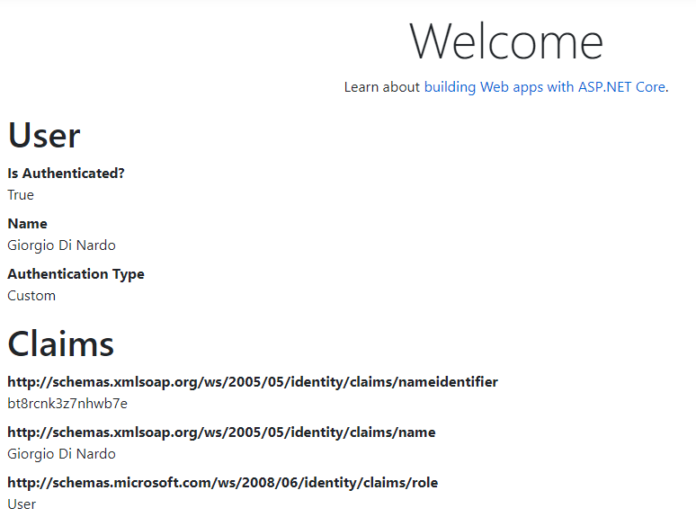

# AspNetCore.Authentication.Static
This repo contains the security and authorization Static middleware for [ASP.NET Core](https://github.com/dotnet/aspnetcore) from [Proge-Software](https://progesoftware.it).


## Why?
Whether you are doing exploratory or automatic integration tests, testing the authentication of an ASP.NET Core application can be complex and ineffective.

You may need to set up dedicated accounts in your Active Directory, go through the login process and ensure cookies are always playing the same way.

## What?
**AspNetCore.Authentication.Static** is an unambitious middleware for ASP.NET Core aiming at simplifying authentication when testing your application.

You may define your users in the application's configuration file, and switch between them using query string, headers or environment variables.

As simple as that.

## How?

1. Install the [NuGet package](https://www.nuget.org/packages/ProgeSoftware.AspNetCore.Authentication.Static) using the package manager:
    ````
    Install-Package ProgeSoftware.AspNetCore.Authentication.Static
    ````
    or the .NET CLI:
    ````
    dotnet add package ProgeSoftware.AspNetCore.Authentication.Static
    ````

2. Add the middleware to the `ConfigureServices` method in your `Startup.cs` file:
    ```csharp
    services
        .AddAuthentication(StaticAuthenticationDefaults.AuthenticationScheme)
        .AddStatic(options =>
        {
            Configuration.GetSection("StaticAuthentication").Bind(options);
        });
    ```

3. Configure it in your `appsettings.json` file (you should better do it using [User Secrets](https://docs.microsoft.com/en-us/aspnet/core/security/app-secrets)):
    ```json
    {
    "StaticAuthentication": {
        "Identities": {
            "User": {
                "AuthenticationType": "Custom",
                "NameIdentifier": "bt8rcnk3z7nhwb7e",
                "Name": "Giorgio Di Nardo",
                "Claims": [
                    {
                        "Type": "http://schemas.microsoft.com/ws/2008/06/identity/claims/role",
                        "Value": "User"
                    }
                ]
            }
        }
    }
    ```

4. Run!

    

## What's more?

You may have a look at our samples to learn more on how to use it.